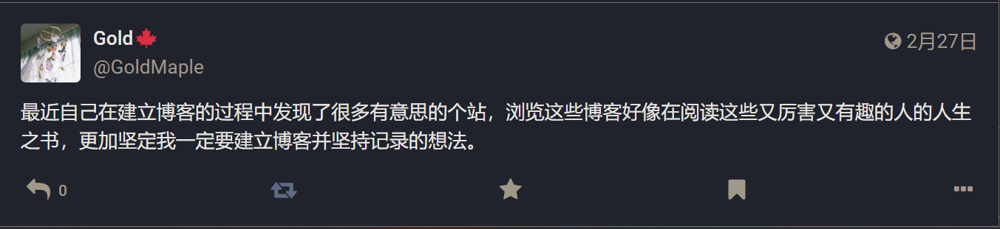

## 故事的开始

    

有了建博客想法的这半年里，由于某种巧合点进某个博客，透过某些文字了解到某些人生的选段，成了我闲暇时最享受的事情。

从一个博客跳到另一个博客，一本本人生之书在向我展开。

如果能因为我们思维中某些火花的相似，建立起微弱却也有力的连接，那该有多好呢✨

---

我会在链接后添加一些备注，如果觉得不妥或是想保留原来的描述，请联系我修改

我也会列举一些持续关注的单向链接，一般我都会在仔细阅读博客后确认没有拒绝单链的字样再添加，但如果我漏掉了，请联系我删除

在时机成熟时，我们可不可以交换链接呢？

---

## Friends

🐈‍ [谢谢所有的鱼](https://gregueria.icu/):小鱼，写作很厉害的朋友！隽永而有氛围感的文字，一句话常常让我反复品读。

🥯 [圆面包如何逃离狐口](https://sunnkynews.icu/):盐，面包屑炸面包蟹。

---

## Focus

🧶[第三夏尔 | Third Shire](https://thirdshire.com/)

🐈[A Purrception (tortie.me)](https://tortie.me/)

⭐[g1eny0ung 的博客](https://g1en.site/)

---

## 我的链接
- 名称：珊瑚阁GoldMaple
- 链接：http://goldmaple.info/
- 个签：捕捉瓦坎达的风

