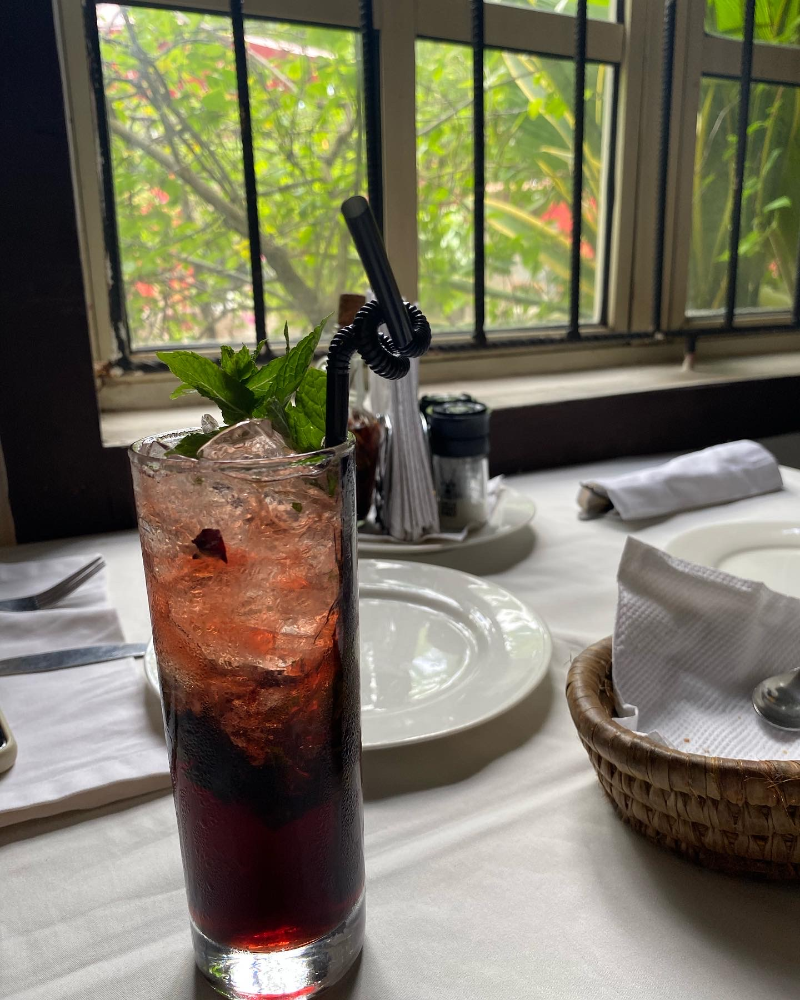
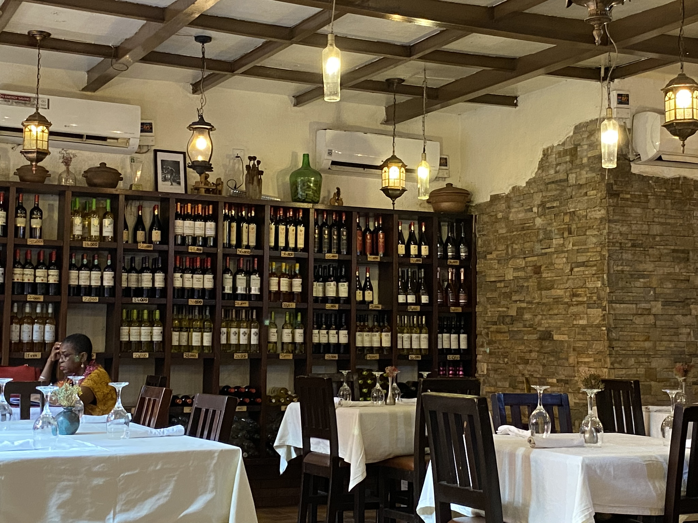
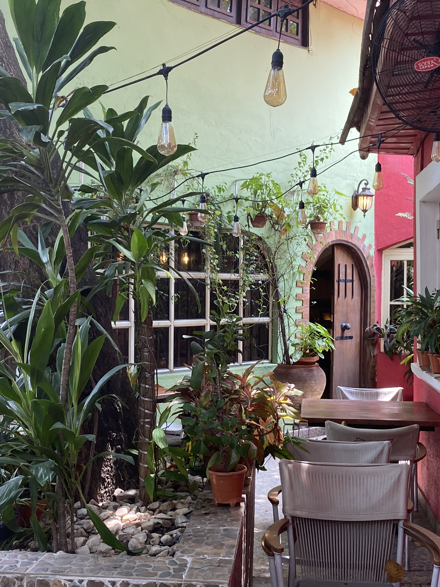
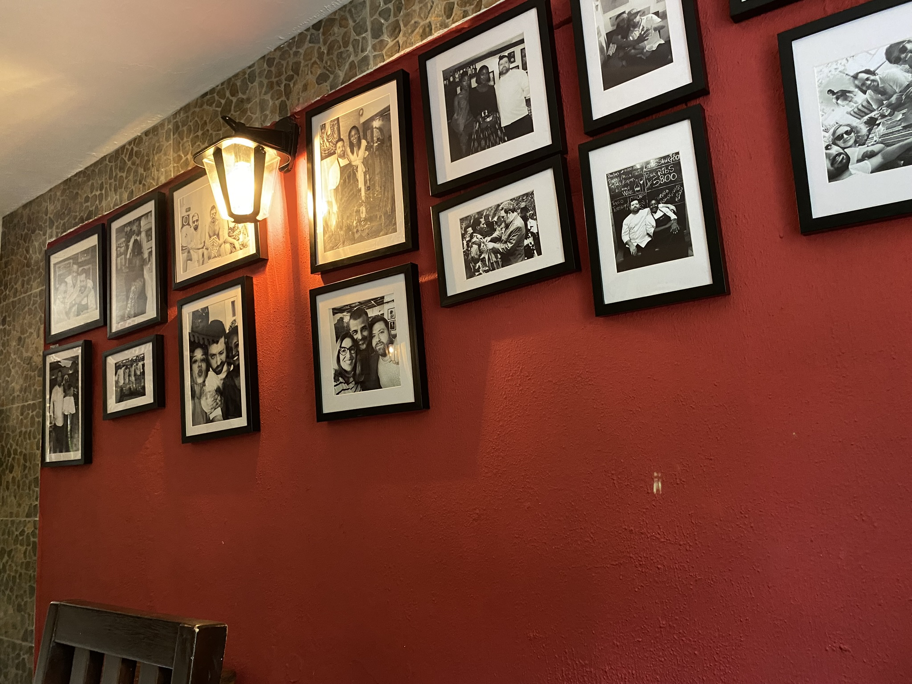
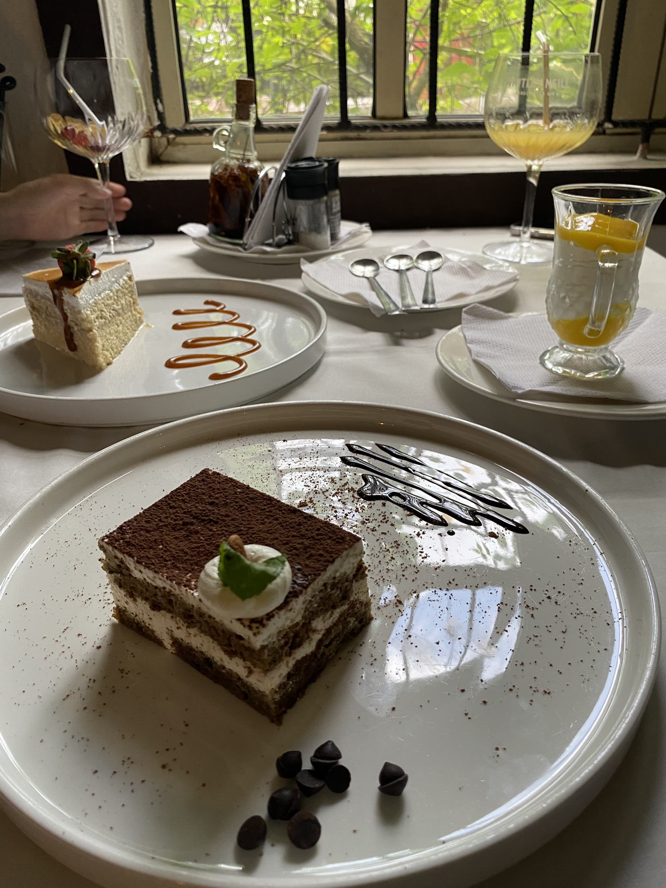

> 生活中痛苦而甜蜜的东西，怎么会这么多？

怎么讲，又是奋斗金沉甸甸的一篇月记，在工作之余，我好像必须要忙碌着什么才能维持生命的运转。其实这篇博文从七月一日就开始动笔了，思绪和想法太多太乱，数次打开编辑器又关上，梳理梳理着，八月来了。

---

## 🐱国际合作跨区域拯救痛经大作战
我是在小红书上认识的小林，她和我同城不同区，虽然没有见过面，但是非常聊得来，上周她问我在尼日利亚如何办理本地Visa卡，她们公司的人都没有当地Visa卡，她很着急购买鱼油。

我虽然疑惑买鱼油有什么可着急的，但是跟她解释了尼日利亚办卡既需要办理NIN又需要办理BVN，要等上一阵时间了，不如先用我的卡吧。

小林非常爽快地从公司账户往我卡里转了钱，跟我安利起这个鱼油，并说出了她着急的原因：这里是在海边，有些潮湿，她的痛经比之前严重得多了。之前只是吃一颗布洛芬就管用，现在吃两颗仍然疼得厉害。而提前吃鱼油对她来说可以有效缓解痛经。

同被痛经困扰，曾经一度痛到吐的我感同身受。我的拜耳小蓝片剩得不多，但在我回国前还够用，我想分享给她，就是不知道这边的同城快递让不让寄药品。

- 不过说来好笑，什么同城快递，不过就是打电话叫来一个会骑摩托或者电动车的本地人，把货物和派送费给他，然后便开始祈祷货物可以安全送达，因为不安全送达我们也没有任何办法。

但是不管怎么说，一场防治与急救并施的国际合作跨区域拯救痛经大作战就坎坷地开始了。

---

首先是她转给我的钱，因为金额“过大”(12万奈拉折合600人民币)，银行以达到账户限额为由把我的奈拉visa卡暂停了(但是我的限额其实是一百万奈拉)😂我跟小林晒了截图，无奈我们只好等第二天再付款。

另一边，我找到了我在公司最喜欢最信任的黑人女同事Florence，先是问她同城可不可以寄药品(是我想多了，这里的同城快递根本不限制邮寄的东西)，在得到肯定的答复后我请求她帮我寄快递，她是网购达人，自己还经营着一家小卖部，对这些门儿清。

在我跟Florence说明了我在给痛经的朋友寄止痛药后，她也非常关心。我是在下班后拜托她的，她一早就找人发了出去，早上上班还没有一个小时，小林就收到了快递并且跟我感叹了Florence的高效。

---

小林还说，这个包裹上有一种香气：

- 花香的🌷
- 轻微粉感🪮
- 夹杂着海洋🌊或者苔藓🍀的味道

我说这应该是Florence的香水味，并向Florence传达了小林觉得她的香水很好闻。Florence说这正是她店铺里卖的香水，而我跟小林还想要支持她的生意这些就是另一段故事了。

反观另一边的银行就没有那么高效了，快递送到了，奈拉卡还没有解锁呢，而且当天银行的软件还发生了故障，联系不上任何客服(尼日利亚的银行真的是稀烂)😅于是我又从币安里提了点美金，让小林直接用我的同行美金visa卡顺利结账了。

一周过去，小林给我带来了好消息，吃了小蓝片，这次月经她完全没有痛😁

我宣布这场国际合作跨区域拯救痛经大作战大获成功！ 🫡

---

## 💲了解加密货币，掌握换汇自由

尼国是个银行体系相当封闭的国家，各处消费只能用现金和本国的银行卡，银行有意不放出现金，作为财务人员想要跟公司申请办卡又有些敏感，于是我选择自己注册电子钱包的虚拟卡。

在尼国办卡还真挺不容易，前后搜集准备了一个月，6月初我终于拥有了自己的虚拟卡，但是电子钱包不允许外国银行卡入金🤯又花了一些时间了解加密货币，最终成功实现从人民币到加密货币再到奈拉，折合下来的汇率与黑市汇率相差无几并且将手续费降到了0.2U😁

---

## 🍝 西班牙餐厅

可以自己换汇，于是马上去消费了hhh

同事在ins上发现了一家不错的西班牙餐厅，餐厅的布置就很出片，封面图也是在这家拍的。

人均不到一百，沙拉🥗和意面🍝都非常好吃，特色的烟熏猪肉好吃到出乎我的想象。（但是手机拍得很不好看就不放了，等回国买了相机再去拍一次）

---

去的那天阳光很好，我和同事选择了窗边的位置，在聊天中展望未来的样貌。在这些勇敢智慧的女孩中间，我好像也汲取了足够的能量，在长久的不自由中短暂体会到自由的感觉。也是在这天我确定了接下来两三年的大致方向和目标。

这个世界很大、也很小。我们何处不可去？

---

## ✈️规划，规划还是规划

这个月本P人痛苦但坚定地做了很多攻略和规划，虽然知道会带来焦虑和进度不达预期的痛苦，但我知道如果不提前做好规划并为之努力，我会更加后悔没有尽力。

---

### 工作/地域/未来

因为地域的特殊性，公司要尽可能保证员工安全，我们的出行也就相对不便。不用说搞什么副业，就连交朋友都很不便。总之外国人，尤其是亚裔女性在这里想做点工作之外的事情真是不太容易。

其实我完全没有要从现在就开始当守财奴的想法，我清晰地认识到，我要在三十多岁认知和经验提升上来之后，才能赚到一生中的大部分财富。所以想趁年轻去多旅游多学习，结识更多的朋友，寻找真正适合自己的方向和机会。

由于这些矛盾的存在，虽然目前公司的氛围和薪水我都很满意，但我不认为我会甘心在这里度过我的二十代。于是在工作满一周年之后，我开始焦虑地规划工作/地域/未来。

这种焦虑无疑是痛苦的，但是焦虑推动着我搜集信息/与前辈请教/与朋友讨论，在月中我终于确定了大致的方向以及当下要做的努力，还去找东玄西玄算了两次命确认我做的判断与命理相符合😁并且做好了在繁忙的工作之余备考的计划🤯

---

### YNAB
>[记账软件YNAB：为什么它是最强的记账app (thirdshire.com)](https://thirdshire.com/why-ynab-is-the-best/)

读到kyo老师的安利帖后就被种草了YNAB，在6月开始试用并订阅。

目前使用下来的感触是：更加清晰了自己的实际存款和在生活各项开销上的花费，并且会因为某项预算的赤字而约束自己的活动。

没有多币种功能支援功能对我来说比较麻烦，但是瑕不掩瑜，于是我现在还是继续使用之前的Moze进行日常记账，以周为单位将花费同步到YNAB中做预算。并且使用插件进行多币种的转换：[Plugins for YNAB](https://ynab.rmillan.com/)

另外赞美所有做网页端的软件。

---

### Tripsy

>[想去的地方很多？用 Tripsy 轻松制定旅行计划 - 少数派](https://sspai.com/post/89705)

其实从今年的年初我就开始用Notion规划日本行了，我对于旅游攻略笔记有美观性直观性的要求，无法接受直接把链接丢进Notion，往往还要自己在帖子找到封面/提炼要点输入Notion，在Notion做旅游攻略还是极大地耗费我的时间和精力的。

如果说前面的想法和软件是在增加规划的内容，那么改用Tripsy规划旅游便是有意地给自己减负节能了，生活中要规划的重要的东西太多了，让专业的软件干专业的事情，对于我而言，把链接简单地甩进软件就能方便美观地浏览参考就是最大的意义。

---

## ⏰5 AM CLUB
从七月开始，为了备考，我断断续续地开始尝试每天5点起床。

这种方式的好处和原理，这条视频里讲得很清楚了：[坚持5点起床一年, 我搞懂了早起改变人生的秘密](https://www.youtube.com/watch?v=4zXTyc2ZjXM&t=1s)，这也正是我的启发视频。

在我断断续续执行5点早起一个月之后，我最显著尝到的甜头是：我不再责备自己，我有一些找回过往缺失的对人生的掌控感了。

---

早起在一些时候非常痛苦，生活真是劳累啊，为什么我强调“断断续续”，因为有时候即使我用三个手机定了六个闹铃，我也一夜无梦地睡到了八点半。😶‍🌫️

于是这又促使我开始早睡，现在我的入睡时间已经从凌晨两点提前到了十一二点。

而为什么与之前相比，我能成功地提前入睡时间，因为5 AM CLUB使得我清晰地划分了时间，夜晚是用来奖励自己的，学习是交给明早那个清醒高效的自己的。

于是我从晚上焦虑地玩手机，焦虑地不想入睡，转变心态变成了晚上安心地玩手机/读小说/做旅游规划，为了把充足的时间精力交给明天的自己而带着期待感满足感入睡。

而第二天早上，我不再一起床就毫无选择地匆匆忙忙赶向办公室，睡眼惺忪地坐在位置上时还在指责自己为什么昨晚又熬夜了；而是在高效率地学习了那么久之后，清醒地满足地来到办公室。上班摸鱼时还可以复习一下笔记做做练习题。

---

纵横四海的《时间贫困》播客中，提到了时间效能感的概念，毫无疑问，早起提升了我的时间效能感，对我而言，时间不再是被动地浑浑噩噩地匆匆流逝。我感到我是强大的，我是有选择的，我是在进步着的。

起初看到视频里把早起描述得如此美好而作用强大，我是半信半疑的，但我没有想到只是执行的第一个月，我就会有如此多的感受。只是简单改变了起床时间，就改变了我的心态，改善了我焦虑熬夜的顽疾，让我陷入了一个痛苦而甜蜜的正循环 🔁✨

---

## 🍬那些痛苦而甜蜜的东西

最开始，“痛苦而甜蜜”只是我在构思博客时突然出现在我头脑里的概念，然而写到这里，回过头一看，我越发感觉到这个题目的恰当。

其实一切痛苦来源于清醒地觉察。

而一切甜蜜来源于，在积极清醒地努力生活中，感觉到自己变得更勇敢更强大，可以更好地掌控自己的人生。

快乐太过宽泛，喜悦太过正面，幸福太过平和，只有甜蜜能表达苟延残喘的我在摘到那个苹果并恶狠狠咬下一口的感受。

---

那天小林推荐了我一位紫微斗数的师傅，他对我的批语让我很受鼓舞：

> 努力、坚定，然后便如一颗火星引燃爆发。