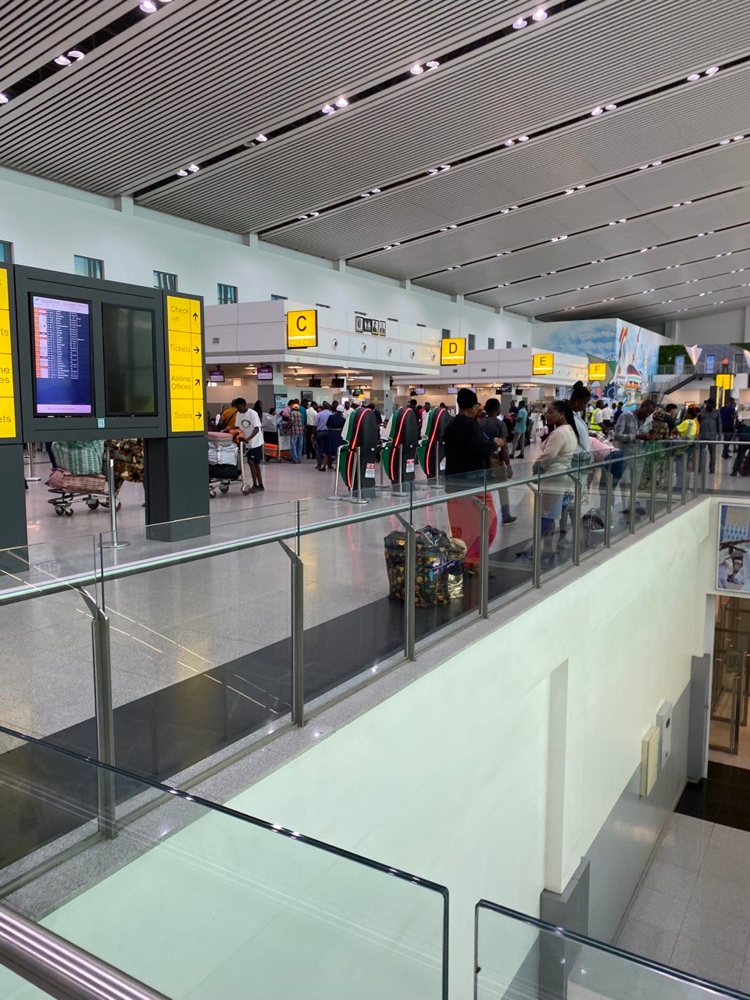
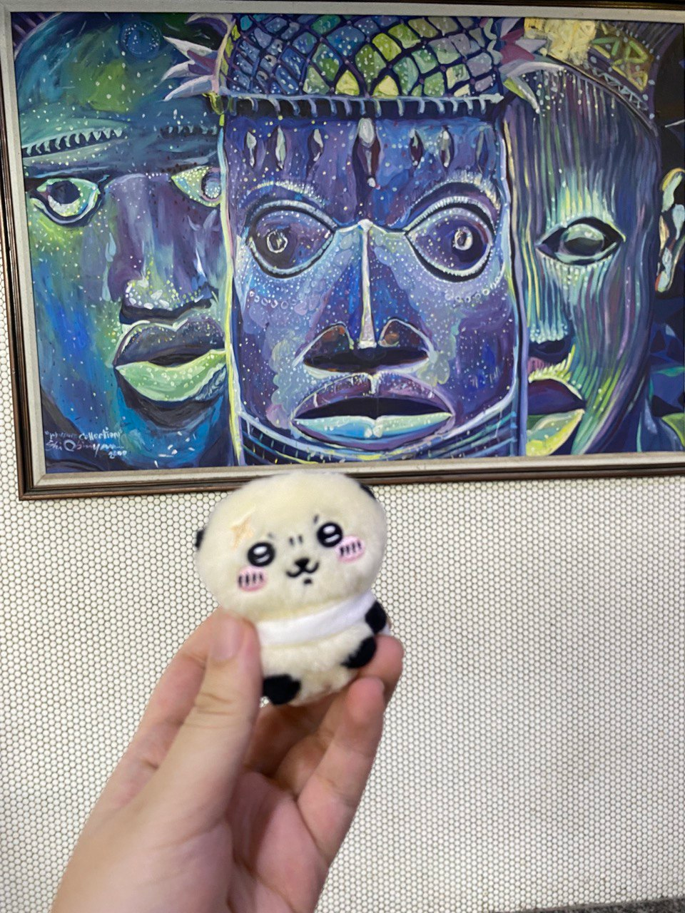
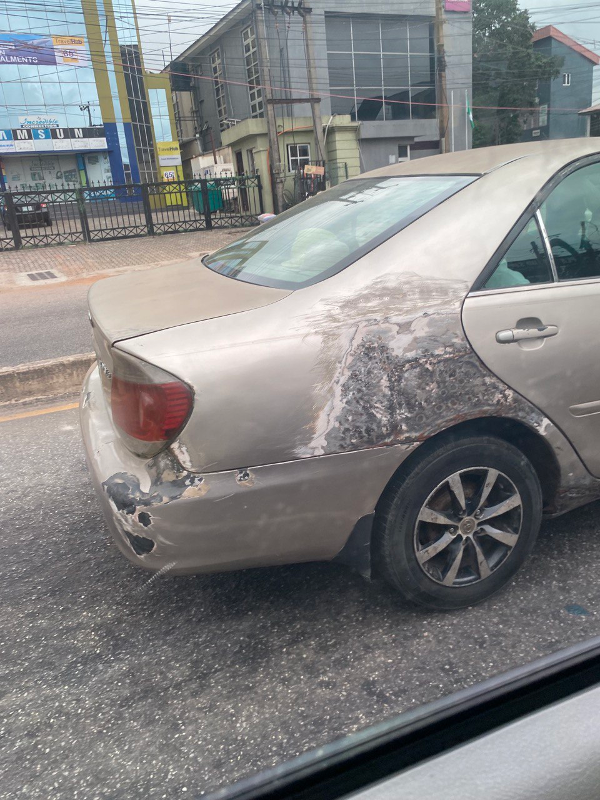
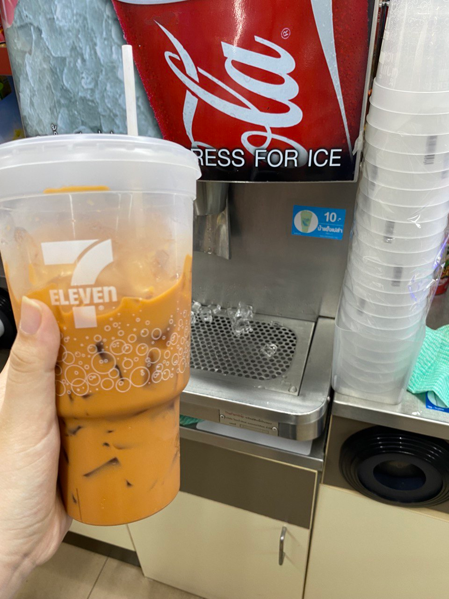
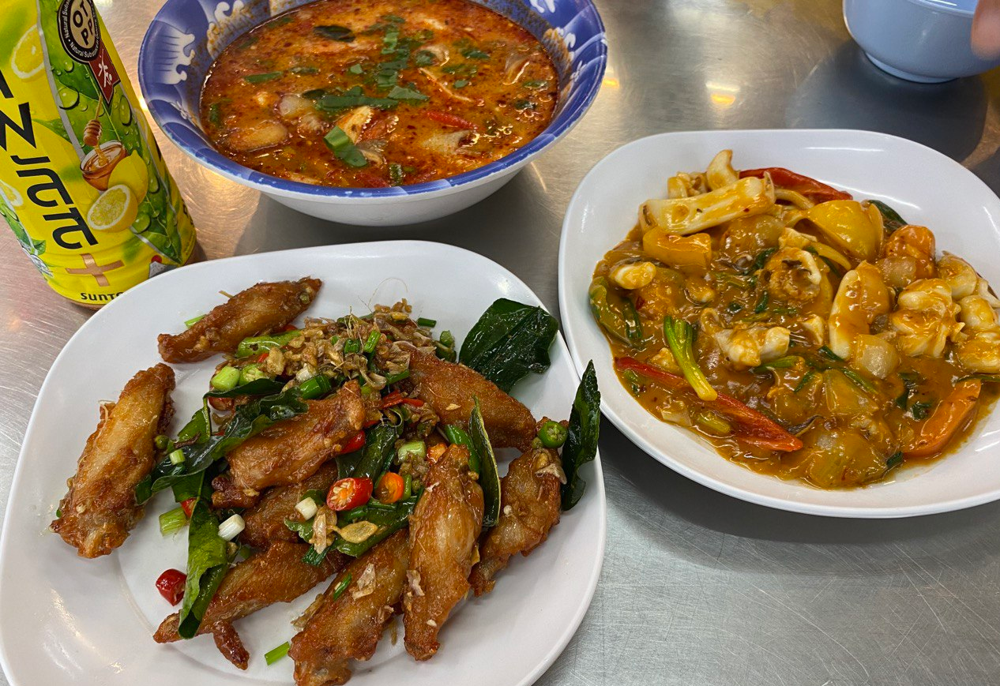
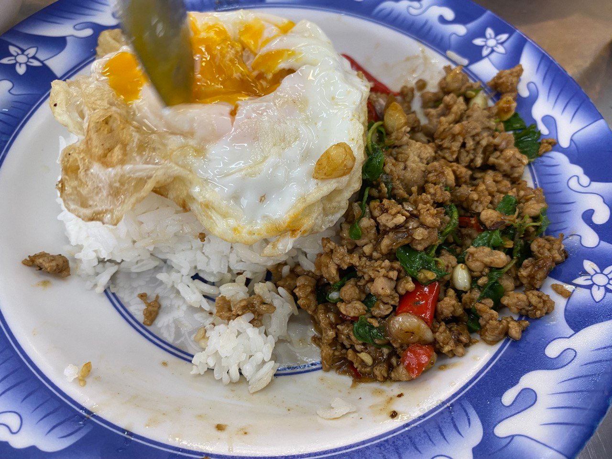
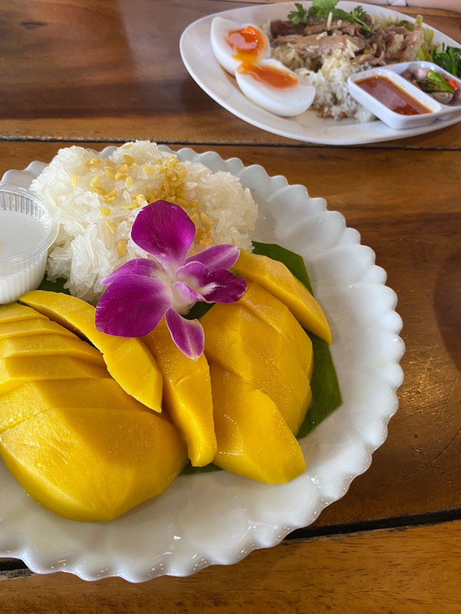
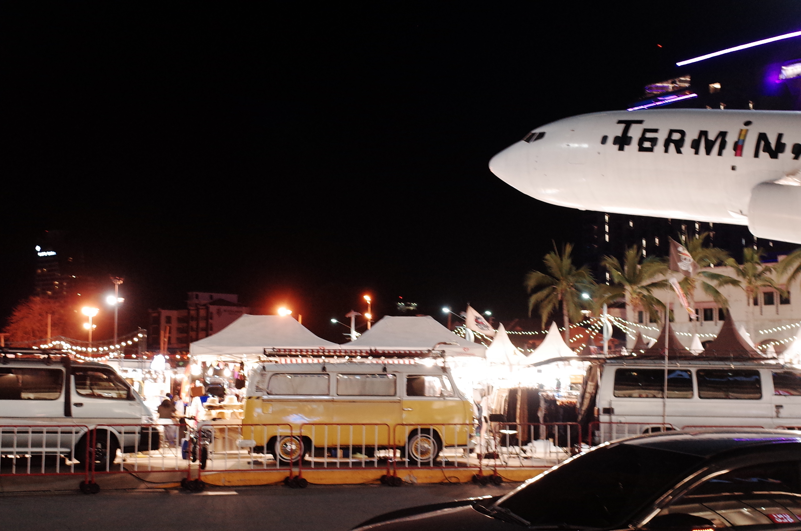





终于在十二月有时间动笔，并在圣诞节的假期里熬夜写完了九月的月记博客。

坚持写作对我来说绝非易事，工作、考证、社交、锻炼、学语言...作为普通人我狼狈地在非洲努力生活着，然而记录又是如此有必要——

从休假开始到现在，不过才过去短短三个多月，但在某一瞬间，我突然清晰地意识到，在各种微小事件的逐步影响下，与三个月前相比，我已经完全变成了另一个人。

我的目标与愿景、生活态度、兴趣爱好、交友观、恋爱观、对职业的规划、对不同国家的看法、mbti，都与那时截然不同了。

回看我这一年写的短短几篇博客，感到熟悉又陌生：“我那时是那样想的吗？”

原来每篇月记都像是我当时的灵魂切片。

那么我之所以在12月末还在执着回忆9月，无法将月记草草平账，一定是因为那的确是我值得珍藏的无比丰盈的一片灵魂。

> 九月实在是发生了太多事情，最终决定用数个机场作为线索，串联这些故事与感受。

## 穆尔塔拉·穆罕默德机场

一大早到达拉各斯机场，行李箱三个轮子被颠掉了俩。挥别叮嘱我给他们带礼物的司机和警察，我把独轮行李箱横过来提着向机场走去。

整个值机大厅就看见三四排椅子，我买了本地特色的鸡肉派垫肚子，只能站着吃。去买鸡肉派的时候又被黑人“求婚”让我带他去中国了🙂。

结束这些小插曲，对我来说更重要的是如何通过机场工作人员的层层盘剥检查。

拉各斯机场可以说是世界最黑的机场之一，机场里的每个工作人员都想找由头敛财。在我一年半前第一次抵达这个机场的时候都被惊呆了，工作人员凡是看到亚洲面孔就狂热地喊“we are best friends, give me 小费（他们会说中文的小费）”。印象尤其深刻的是，在传送带取行李时，我明明能自己能拿下来，几个穿制服的虎视眈眈地围在我旁边，非抢着搭把手，我说thank you，其中一个人抓着我的行李箱不放开，问我只说谢谢吗？说我的谢谢means nothing，他要钱。我说我第一次来这个国家，没有现金。他就骂我bitch🤨。行李箱之前掉的轮也是被工作人员摔坏的。

回忆结束，但是此时幸运的是：

在我出发前不久刚有一个机场官员因为受贿被惩罚；

有经验的同事告诉我，见到工作人员就跟他们扯闲磕，提供情绪价值可以大大降低被检查要钱的概率，于是我一路过关卡一路"Good morning. How was your day?"。

这些因素叠加，使得我的独轮行李箱在历经十几个工作人员后都没有被要求打开给钱。只有最后一环被问chop chop（尼国要钱要小费的意思），我用“下次一定”敷衍了过去。

我问候工作人员时，他们都很惊讶又很高兴，好像很少有中国人会这样问候他们，在检查证件的时候还在和我聊天。这些黑人大妈大叔不追着我要钱的时候还是很有人情味的。他们夸我英语好、人好，并祝我good day, safe flight。

祝福总是好的，I appreciate it。

在机场排队时我先后和三个中国人同行，聊得很开心加了微信。后面又和一个去厦门大学留学的黑人女生在排队时聊了起来。其实这时我变e变社牛的属性已经初见端倪🫡。

- 机场评分：⭐（其实一颗星都不想给）
- 战损风机场，值机大厅开个空调装修得现代化充门面装装样子（还没有足够的椅子），厕所简陋，购物长廊和候机厅更是不开灯、不开空调，候机厅竟然是灰蒙蒙的玻璃夹出的一条狭窄的过道，两侧放了灰扑扑的蓝色椅子，建筑风格类似中国八九十年代的客车站，我不忍拍照存图，气质上参考p3尼国的汽车风格。

## 哈马德机场

又认识了一个外派休假的朋友，开心。

遇到了一队巨婴小留，没有礼貌地要求我帮忙，不开心。

买了杯咖啡，支付宝支付不了，幸好ocbc卡可以刷（在写博客这时已经被通知关户了呜呜呜），决心去香港办卡。

- 机场评分：⭐⭐⭐⭐⭐
- 非常喜欢这个机场的豪华卫生间，又宽敞又干净，四小时换乘我能去三次卫生间🫡。

## 广州白云机场

### 你送的花

作为东北人，落地广州再回家对我来说很不方便，可是相识9年的朋友在湛江读书，多次邀请我我休假的时候找她玩。

最开始她让我陪她在广州玩两天，去湛江玩五天。我对于湛江完全不了解，问她是否有什么旅游规划，她说没有什么景点要看，只是想让我陪她去吃五天东西。

我的年假只有30天，如果光是为了去湛江吃东西就安排五天出去，剩下的时间就太紧张了。我在6号有考试，湛江到我家的航班少且没有直达，光是转机还要花额外一天，而且行程不连续，机票报销起来很麻烦。跟她讲了我的顾虑，商量过后我们把时间调整为在广州玩四天。她当时也很开心地说，刚好她还没去广州玩过，我们约好去吃早茶。

下午四点落地，飞机晚点了半个小时，手机有信号时才收到她发来的很多消息，我马上回了电话过去，她说为了晚上这顿大餐她今天一天都没吃饭，现在还多等我这些时间都要饿死了，必须要宰我顿大的。

回国要见到朋友的兴奋盖过了很多，我笑着说好。

她在接机的地方捧着一束花等我，我跑上去抱住她，抱了足足一分多钟。

### 中暑

我最开始感到不舒服，是在去宾馆的出租车上。

飞跃了11727公里，21个小时的行程。然而从那个拥抱过后，她就没有哪怕半句问我累不累、在非洲怎么样的寒暄和关心，而是马不停蹄地开始吐槽她的实验室同学，其实这些事情她在此之前已经至少跟我说过三遍，我甚至可以复述了。

我刚开始还在回应她，可是等到出租车行程过半，她的吐槽已经持续了一个多小时，该回应的我早都回应过了，她又把相同的事情反复讲了两三遍，我实在有些累了，看着窗外的街道转移话题：刚从非洲回来，看到街道这么平整还有些不适应。

她不知道是怎么想的，突然来了一句：你在非洲过得可比我容易多了，黑人肯定没有我实验室的同学难对付。

我很惊讶地看着她，不知道她为什么会突然进行这种比较，一时竟有些失语：你也被你实验室的同学背着枪威胁、要你给钱吗？

她很勉强地说：啊这倒没有。

我此时只是感觉有点奇怪，并未放在心上，问她有没有选好晚上的餐厅，她说就在宾馆附近，是她想吃的一家西餐厅......不吃早茶什么的吗？她说我飞机晚点了让她等这么久，现在她最想吃的就是那家西餐厅。我说好吧，又问她需不需要打车去，她说不用。

于是在九月初的广州，刚结束国际航班的我，跟她在户外走了二十多分钟。她走得很快，我跟着她在走到十分钟左右时，已经开始冒冷汗了。我喊住她让她走慢点，广州太热了，我已经开始冒虚汗了，她说：你在非洲怎么那么缺乏锻炼啊！

我：我已经二十多个小时没有好好休息了呀，身体很虚。

她：那我还每天只睡六小时呢！

我：休假前这一个月我又要备考又要交接，每天睡眠也不足六小时哇。

她回，哦。

结束了又一场比较。

等找到位于商场里的那家西餐厅时，我已经出现了中暑的症状，持续性地打了十几个喷嚏，鼻水止不住地往下流。

可是因为她忘记预约了，那家餐厅排队很长吃不上了，我让她再选一家粤菜什么的，她说太饿，就随便走进了对面的一家泰国菜餐厅。

菜上得很快，全是预制菜，冬阴功毫无泰味，味道更像是三杯鸡。

我们两个都吃得很沉默，我没忍住说：落地第一顿饭就吃这个，预制菜一进口天都塌了。

她：都是因为广州菜不好吃啦，谁让你不跟我去湛江。你下次休假的时候，一定要把时间安排在五月份，陪我去湛江吃一周！

我：公司安排休假也不是随便休的，要跟同事协调的呀。而且不是说好吃早茶的吗，一会吃西餐、一会吃泰餐，怎么我好不容易回国连顿中餐都吃不上。

她：好吧！我没有想到！那之后的餐馆你来选好了！

当晚回到酒店，我一边喝藿香正气水，一边选着第二天的餐馆。

没回国的时候，她就跟我说了想去一家diy香水的店，我把这个行程安排在了第一天。香水店在商场里，附近的早茶评价不太好，我找了几家粤菜餐馆。发给她一起选了一家。

### 拉练

第二天起床虽然还是有点虚，但是补足睡眠已经感觉好多了。她看了地图说，我们走去就行了，路很近的。

太阳毒辣，没有伞，她又在前面快步走着，我被晒得有些发晕，中暑症状又加重了，强打精神问她：平时这个天你都不打伞的吗？我感觉我都要晒晕了。

她：还没到真正热的时候，这种天我都不打伞的，你在非洲还没有我在广州能吃苦呢。

我没有理会这随机出现的莫名其妙的比较，努力心平气和地说：一会去商场里买把伞吧。

她：我酒店里有伞啊。

我很惊讶：那你为什么不带呢？

她：我故意不带的。因为我觉得应该让你锻炼适应一下！

我：...那你能但凡考虑一下，我是个昨天晚上刚中暑的人吗？

她：哎呀！我忘了这事了！那我回去给你拿伞？

我叹气：算了还是打车去饭店吧。

### 香水

坐在车上，头疼恶心，我已经在点外卖送藿香正气水到饭店了。想起来昨天忘记预约的事情，提醒她记得预约香水店。

她果然忘记预约了，拿出手机下单，问我预约几点的，我去看她屏幕上的选项，选定了时间，但是在人数那里她只选了一个人。我以为她又粗心了，提醒她看清楚链接，下单两个人的。她说好。

这家粤菜其实挺好吃的，即使我正在犯恶心，也觉得这菜清淡又有味。但是她一直在抱怨，说广州的菜真的不如湛江的好吃，再次说，让我下次休假的时候，把时间安排在五月份，去湛江吃一周！

我没有回应。

吃完饭去香水店，店里没有多余的座位，我头晕恶心站不住，跟老板说，我中暑有些难受，有没有多余的位子给我们坐着等。

老板说，要有预约才能坐。

我说我们预约过了的，老板说预约了先去扫码选香型。

她听了这话，已经自顾自地扫码，在橱柜陈列的瓶瓶罐罐里选味道了。

我靠着柜台又喝了一瓶藿香正气水，不愿扫兴，强打精神去扫码选香。

她很惊讶：你也要调香？

我：我可以不调？

她：当然啊，我只下了我一个人的单。

我：......那我在这站着等你吗？老板说不预约不能坐位置。

她：对啊，你大概等我两三个小时吧。

### さようなら

当时的我甚至因为感到过分荒唐笑了出来，我说：哦，那我出去看看。

走出商场门，我就直接打车回了酒店，路上就把房退了，改签了第二天凌晨的机票。

回酒店休息了一会，收拾完行李已经是下午六点，我出门把从非洲带回来的礼物给朋友们邮寄了。

她给我打电话说她刚做完香水，问我在商场哪里，我说我回酒店了。

她：啊？你回去了？那晚上我们吃什么。

我：我晚上不吃了，改签了明早的飞机回去。

她：为啥啊？

我：不说了，我还在给朋友寄快递呢。

她打包了东北烧烤回酒店。

我说没胃口不吃。一边收拾一边告诉她，酒店我已经退房了，她可以呆到明天中午十二点。

工作后的每个节日，我都一个不落地送她礼物，她给我发链接说喜欢某个机械键盘，我自己都不舍得用这么贵的，还在薅公司的羊毛用双飞燕，却买了送她做生日礼物。酒店、吃饭、打车，都是我付的钱，她只有下单香水diy和这顿东北烧烤花了钱。

她一边吃着烧烤一边对我说，这次旅游的花费等她有钱了再跟我AA，啊真的好遗憾啊，这次你都没能吃上早茶，你下次休假的时候，一定要把时间安排在五月份，去湛江跟我吃一周！

我笑了，没回话，她又追问了一遍，问我听没听到，我说好。

到底是你太高看了自己，还是太低看了我，凭什么觉得做到这个地步，我还会再为了你从非洲飞到广州，浪费四分之一的假期，承担所有账单，陪你吃饭。

我们是高中校友，我的朋友很多，但她没什么朋友。到了大学她主动联系我，说想和我做朋友，我们的关系才亲近起来，我视她为挚友是在我考研失败期间的，那时候我很挫败、自觉人生失败，而她一直在我身边安慰我。她对我说：她永远不会背叛我。

来非洲工作后我终于从低谷中走出，找到了自己的人生方向。而她的专业很难找工作，很多次对我说，羡慕我经济独立，羡慕我可以休假，羡慕我可以出国玩。我帮她写简历，帮她搜集工作信息。她又说她没时间学英语，实在不行就找个人嫁了。

你确实应该感到遗憾，我们再也不会有机会一起吃早茶，因为这会是我们这辈子见的最后一面。

直到这个月她还在给我发消息，但是我始终没有回复，没有争吵没有质问没有删好友，我自顾自地斩断了这段友情，听起来可能有点像故作潇洒的精神胜利法，但其实是我不想再给她任何解释道歉的机会了。无论是真的抱有嫉妒心理，还是迟钝得像块石头，都无所谓了，失去我只会是你的损失，我的时间值得与更好的人一起浪费。

在抵达白云机场的35小时后，我又回到了白云机场。

- 机场评分：来也匆匆去也匆匆，对机场并没有什么印象。

## 曼谷素万那普机场

带妈妈去芭提雅自由行玩了三天（她没退休只能请这几天假）。去泰国旅居过的同事本来不推荐带家长去芭提雅的，但是我妈因为单位有个同事跟团去过芭提雅赞不绝口，执着要去😂

- 每天两杯711的泰奶，虽然被我妈骂吃冰太多，但是好喝爱喝🫡
- 抖音上热度很高的船面实在无法欣赏，店门口的芒果糯米饭倒是很好吃。
- 本次最佳一定是这家餐馆：🍲 [ร้านข้าวต้มปาหนัน สาขาพัทยา](https://maps.app.goo.gl/cd4z2tSuTY4pS5is6?g_st=it)
  - 冬阴功、香茅炸鸡翅、猪肉打抛饭必点，咸蛋黄鱿鱼也很香。

和妈妈的这三天旅行，第一天吵架又和好，第二天手牵手看海，第三天逛商场买伴手礼。三天短暂又充实，很快就到了离开的时候。

旅行的时候，我一直带着我的kindle，在候机、飞行的时候正好读书。我清晰地记得我在候机厅拿出来又放了回去，可是在登机后翻包却找不到了。

翻了三次，我不再有侥幸心理，确定是掉在了候机厅。我在想，有可能是掉在椅子上，也有可能是顺着椅子掉到了地面上。

此时飞机还没起飞，有空乘在来回穿梭检查，也不知道还有多久要起飞。

妈妈已经习惯性地开始责备我了，先是说出门旅行不该带这些东西，再是说不应该在候机厅拿出来显摆。

这是很熟悉的责备，有那么短暂又漫长的2秒钟，我已经在心理上退行回小时候，陷入无用的自责情绪了：是啊，早知道...早知道...

但也仅仅是2秒钟，之后我马上掏出手机在小红书搜索如果在素万机场遗失了东西怎么办。我左耳听着她的唠叨，没有回应，手和大脑都没有停下搜索判断。

如果确定是在机场丢失，回去要给素万机场写邮件，即使找到了，也不能跨国邮寄，需要有人到机场来取，真的是相当麻烦。

妈妈此时还在念叨：这下丢了你可长记性了吧！

我已经起身去找最近的空乘人员，跟她说明了我在候机厅丢失物品的情况。

我的本意是趁飞机没起飞还有信号，让空乘先帮忙联系机组人员，至少可以保证我的kindle不被别人捡走，至于后期取回就再想办法了。

可没想到空乘人员特别积极地帮助了我，听说我丢了东西，马上找了乘务长过来。

问清我丢的东西长什么样子后，他们就开始联系泰国的机组人员在候机厅找。并且一直在跟我确认、同步信息。

机组人员那边找了一会说没有看到。

其实这时我已经不抱希望了，本身丢失在候车厅也只是我的推测，他们能帮我找已经很感谢，不知道飞机什么时候要起飞，耽误了他们的正常工作就不好了。

我跟空乘说，如果没还找到的话，我可不可以先填表留一下联系方式等信息。空乘说可以，也正准备给我拿纸笔。

等待的时候，大脑里的想法已经分了岔：
- 如果回国后被找到了，大概只能找个泰国代购帮忙带回了。
- 如果没找到，要新买哪一款呢？
- 还需要再重刷一遍koreader系统，好麻烦啊，数据是不是会丢失啊。
- 不过我已经为此做了努力，没什么可后悔的了。

非常突然地，乘务长把我叫到前面，说还有时间，让我准备好一会跟泰国的机组人员去候机厅找。

我没想到还能这样，大脑其实已经一片空白了，但是表面上非常平静，甚至等待的时候还在和乘务长聊天。

她问为什么这么确认是丢在候机厅，问我会不会泰语。

我说，我确定我在候机厅的时候kindle在我包里，我可以用英语跟他们沟通。

话音刚落，泰国的机组人员就来了，让我跟着她。

那是个中短发的女生，我跟着她飞奔着跑下廊桥。肾上腺素当时一定发挥了巨大的作用，我超过了她，先到了候机厅。

我飞奔着跑向刚刚的座位，跑过去的时候就可以从侧面看到椅子下面，我的kindle套着黑色的壳，地面是米白色的，很显然地上没有。

我的心揪了一下，短短的一瞬脑子里闪过巨量的想法，开始怀疑自己的记忆是不是对的，甚至已经觉得没有找到是件小事，让这么多热心积极帮助我的工作人员们白忙一趟，失望而返才是大事。

我冲刺跑到椅子那里，明明已经知道不可能在地上了，还是用手撑着椅子准备细看椅子下面。

但是却突然摸到了什么东西。😂

原来黑色的kindle倾斜着放在椅子靠背上，和深蓝色的椅子阴影几乎融为一体，即使是近看都发现不了。我打算撑着椅子却一脸懵地摸到了kindle并抓了起来。

这一切只发生在短短的几秒间，在工作人员看来，就是我一路跑过来，甚至没有停稳就抓起了kindle向她跑去。

候机厅里的两个工作人员都很开心。短发的工作人员又带着我往回走，我真的很怕影响到这些工作人员的准备工作，跑得飞快，她一边笑一边告诉我不用跑那么快。

我真的很难形容当时的感受，一切的一切都太顺利了，我从未跑过那样畅快的一段路，快乐得好像不真实。我现在还记得机组人员跑在我前面，短发在跑步时飞扬起来的样子。我握着kindle紧随其后，跑步带起了风，鼻尖嗅到清凉的味道，像是夏秋交接之际迎来了第一缕风。

我迈出了勇敢的一步，幸运于是落在我身上。

迎着几个空乘惊喜的目光跑回机舱，乘务长还冲我喊道：找到啦？太好啦！不用跑那么快！

我气都没喘匀，对着这些工作人员中文英语泰语交替着说了一堆谢谢。

虽然我写了这么多，但是这是非常短的一段时间里发生的，因为等我坐到座位上，飞机还等了好一阵时间才起飞。

- 机场评分：⭐⭐⭐⭐⭐
- 机场的卫生间虽然不豪华，但是干净、又香香的，机场里的泰奶还是很好喝，工作人员值得一个满分。

## 深圳宝安机场

去香港办银行卡，从深圳过关。

小红书上搜到行李轮盘的更衣室可以免费洗澡，凌晨给门上贴的号码打了电话，阿姨的态度真的超级好，很快赶到来开门，问我：阿妹要冲凉呀？🥹🥺

更衣室里的浴室很大很干净，还可以存放行李。洗完澡喊阿姨关门，阿姨说，记得给个好评哦。

- 机场评分：⭐⭐⭐⭐⭐

## 香港国际机场

### 好事多磨：香港办卡半日游

假期进入倒数日，我的行程规划得非常之特种兵，凌晨从深圳过关，坐巴士去机场寄存行李后，赶到元朗路办中银和汇丰银行卡，办完卡之后赶回机场飞去大阪。

然而在实际操作中，出现了很多意外，最后之所以能达成圆满结果，真的要感谢旅途中遇见的好心人🥹感谢幸运之神眷顾🥹。

首先是去深圳的航班因为天气延误了三个小时，但是好在没有被取消，不然后面这些规划都白费了。

凌晨从皇岗口岸过关，要赶上末班是4:45的NA43，7点前到机场才能来得及在银行开门前到达。本来我是有四五个小时过关的，可是飞机延误后时间就不太宽裕了。四点钟终于到了皇岗口岸的巴士站。

小红书的那些攻略真的很难懂啊🥹我还以为是直接在皇巴散客那里等NA43，眼睁睁看着写着落马岗的巴士走了一班又一班。

车站也没有工作人员可以问，我去问那里停的其他大巴车司机，因为我不会粤语并不能和他们很顺畅地沟通，他们说不知道NA43是什么。

NA43第一班4:05我早就错过，我还以为要等到4:25车才会来。可是等到四点半都没看到车影。我知道我肯定是搞错了什么。

幸运的是有一个去荃湾的司机师傅，主动问我怎么等这么久也不走，他普通话讲得很好，我才知道原来要先坐那个落马岗的车进港。但是这个时候再去已经赶不上4:45的那班车了。

师傅推荐我先坐他的车到荃湾。荃湾有很多车可以换乘到机场。

在师傅的指导照顾下到达荃湾，换乘坐上了到机场的巴士，在六点多到达机场。师傅好人一生平安🥹

---

寄存完行李再坐车出来，刚好在八点半到达元朗路的中国银行开始排队。我是第五个，前面四个人都是来开卡的大陆人。

当时已经明显感觉到港卡在收紧，其实下卡的硬性规定没有变，但是不同分行新增了不同的“规定”来卡人，跟小红书上近期的攻略已经不一样了，元朗路中行规定必须有打印出来的纸质对账单才能领号，pdf不行。

可惜的是我之前明明已经打印过证券交易和银行流水的对账单了，但是因为这一早上昏昏沉沉匆匆忙忙，把文件落在了行李箱里，寄存时没有拿出来。

早上九点，附近的打印店也都没有开门。

哀叹一声，我和排在前面同样没有打印对账单的两个苦命同志转战教育路，看看能否有一线生机。

教育路分行倒是不要求纸质文件就可以排号，只是我取到号的时候已经是17号了，那两个同志是15、16号。中银的开卡业务一个人都至少要四十多分钟，不知道要排到什么时候去。而且虽然可以领号了，但是工作人员提出了这个分行的新要求，不可以只用身份证做地址证明🙂必须得有两份地址证明文件，并且地址要精确到室。
- 我问户口本地址可以吗，前台说最好是有水电费账单或是信用卡对账单
- 我是这次休假才办的信用卡，流水不足三个月。
- 我家街道前后改了几次名字，水电费账单早就和身份证地址不一致了。

头脑风暴之余，我们仨又一起去取了汇丰的号，汇丰倒是没有多余的要求，而且先去排汇丰的小姐姐已经很顺利地拿到卡了，可是号码已经排到36了🙂

我们三个难兄难弟组成互帮互助小组，想办法完善资料，又加了微信通风报信中银和汇丰分别叫到哪个号了，随时同步最新消息。

时间来到十点半，我的地址证明仍然不保准，只能问我妈要了水电费账单和户口本照片。但是从谷歌地图上看到附近的打印店已经开门了。这两个同志用的都是华为手机地图不好使，我问他们要不要一起去打印店，他们觉得没必要。

闲着也是闲着，我鬼使神差地去把对账单打印了。没想到这个会在后面起到重大作用。

---

十一点半，中银有好几个号没来，直接点到15号同志。然而巧的是，汇丰也已经叫到33号了。

我感觉我的两个号好像会被同时叫号，开始纠结，汇丰是一定会下卡的，但是中银的地址证明不一定符合条件。但是16号同志帮我分析了，中银的卡更实用，还是尽量保中银。

正做好决定，窗口就开始喊16号和17号了。

帮我办业务的是一个看着非常亲切的小姐姐，打过招呼后，没等她开口问，我就开始主动提交材料了。

其实我提交材料的顺序还是有些心机在的，先挨个详细介绍了打印出来的没有任何问题的材料，跟她介绍哪个是银行流水，哪个是证券账户，并很清楚地指出我的姓名在哪里，这是几月到几月的账单。在她还没来得及细看的时候，我拿出身份证说用这个做地址证明。

小姐姐还在翻我的对账单，一心二用地对我说：除了身份证还准备了其他的地址证明材料吗，我说还准备了水电费账单和户口本地址，但是其实只展示了户口本地址的图片给她看。小姐姐核对了户口本和身份证地址是一致的后，就直接开始就我的对账单进行提问，也没有再问水电费账单了。（好耶计划通👻当然其实如果不是为了卡人，光身份证做地址证明完全没问题的）

而且我感觉，在资料满足基本要求的前提下，办卡的时候只要跟业务员挑起话题，聊开心了，基本上就不会再找问题卡人了。

于是在小姐姐问到我的工作信息时，我主动提到，我是在非洲外派的。她果然对这个很感兴趣，问了我很多吃饭、安全上的问题。又问我家人不会担心吗。我跟她说起我原先被家人催着找对象，但是去了非洲他们就不敢催的趣事，把她逗笑了。

她好奇问我可不可以跟公司争取换到发达国家外派，并且表达了对日本的好感。又问我现在是在休假吗，有没有打算去哪里玩，

我连忙表示我也很喜欢日本，刚带妈妈去泰国旅游完，办完卡了明天就会飞到大阪去。于是又跟小姐姐又从非洲聊到日本旅游，气氛十分融洽。

小姐姐笑着说，那我感觉那你是真的很需要办这个卡欸，在外工作、旅游都很方便。

她说出这句话的时候，我就感觉稳了。积极捧哏：可不是嘛。

这时小姐姐已经拿出卡的信封了，一边扫描对账单一边跟我说：其实我们也不是故意不给一些人通过，实在是他们资料准备得不行，像你这种打印着一摞材料过来的，我看到你都想直接下卡了。

我对她表达了感谢之情，她又跟我闲聊，问我有没有吃午饭。我说从早上一直等到现在，请她推荐给我本地人爱吃的餐馆一会去打卡...

---

拿到中银的卡，心中大石落地。马不停蹄地跑到汇丰，刚好叫到我的下一号了。我去跟前台的工作人员说，刚刚去吃午饭了，不小心过号了，请问怎么办呢。前台冷着脸很严肃地说，过号就是过号了，没办法。

我说，不好意思这确实是我的问题，那麻烦帮我重新排号吧，谢谢啦。

前台打印出号码纸，我一看号码已经到一百三十多了，正要接过来，前台想了想，把号码纸撕了，冷着脸跟我说，你先在这等着！

原来她去调整了叫号系统，又叫了一遍我的号，让我去柜台。

感谢这位面冷心热的前台🥹让我的办卡之旅虽然一路艰辛，但是圆满完成。

### B仔凉粉

中银的小姐姐给我推荐的正是这家店。

因为点菜的时候有些犹豫求老板推荐，被老板凶了，只让我点了个水果拼盘，老板就把我菜单抽走不让我点了🤨

幸运的是隔壁桌来了两个可爱的大陆大学生游客，我们聊得很开心，她俩还分给了老板不让我点的卤翅尖。

### 在香港机场被日本人感动

如上所述，我在香港着实遇见了暖心善良的香港人，我感激、祝福他们。

但不得不说，我挨的为难和白眼要多得多，我不愿意详细记录这些，我能理解他们的部分想法，但我难免只能将香港人带给我的感动个体化。

可是在香港机场里，一件小事让我被日本人感动，使得我对他们群体性的文明有了新的认知。（虽然但是，这句话有点像意林的开头了👻）

在值机时，我一般都会早早地去排队（玩手机），这次提前四十分钟去，排在第三，前面是一对日本情侣。

然而排队时站在前面，可能会在开始值机时面临一个突发情况，就是当柜台更换位置，工作人员重新排列杆子时，原先的队伍会被打散重排，而我往往需要忍受中间插队的人，甚至有时只能站到队伍最后面去。不过我在国内公交车站、地铁、机场见多了插队的情况，虽然不爽，但也只能见怪不怪了。

这天在机场排队时，我也遇到了这样的情况，正式开始值机时更换了柜台，工作人员重新排列出一条通道，我叹了一口气，从这边的出口绕了出去，正准备排到新队列的最后。

然而让我完全没有想到的是，前面所有的日本人都给我让出了路😮😮😮

我当时非常震惊，甚至有点不敢相信是在给我让路。直到排在第四位的日本人伸出手掌给我指了一下，我这才迟疑地向前走去，回到我第三的排位🥹

当时的我虽然努力保持平静，但是马上掏出手机给所有的亲友疯狂抠字：啊啊啊你们敢相信刚才我经历了什么吗！！！

我从小到大一直遵守着各种社会礼仪，比如乘坐扶梯严格左行右立，等公交、等地铁时排队。然而我对于这些规则的遵守最终只会有一个结果，就是我被各种不遵守规则的人插队，在我去过的一二三线北方南方城市都没有例外。（如果有哪个城市是严格遵守这些的，请给我推荐）

我真的人生以来第一次有了一种竟然还能如此、早就应该如此的感觉。像是窥见了社会文明的更高级形态。

实在是太令人感动了，霓虹金！🥹🥹🥹

## 关西机场

写到这里竟然已经一万一千字了，而现在已经凌晨三点了，关西的部分我真的有很多想写的，就放到关西旅游篇专门写吧。

## 大兴机场

我在大兴机场迎来了假期的最后一天。

值机的时候我依然是早早地去排队，这次我排在第五，闲着无聊拍下前面四个人（两个男生、一对外国情侣）的队伍给我妈汇报：我已经来值机了。

非常巧合的是，跟香港机场同样的情况又一次发生了，提前排了半天队，开始值机时改换了柜台，工作人员重新排列杆子。

一眨眼的功夫，十几个人跑来插队。

我早就应该习惯这种情况的，可是此时竟然有些不习惯了。

一个年纪稍长的女士跟工作人员抱怨，自己本来是站在队伍最前面的，可现在被这些人插了队。工作人员表示他也没办法。

这个女士可能看我是一个年轻女生，说着说着就要来插我的队。

之前的我可能就忍了，然而在见过社会文明的更高形态后，看到这帮人这死出我心里正烦着呢，你还好死不死觉得我长得好欺负来插我的队。

于是马上就开腔：诶！你被别人插了队，就跑来插我的队吗？

这个女士竟然开始信誓旦旦地扯谎：小姑娘，我刚刚就是站在你前面的呀。

工作人员可能没想到我会拒绝，打量着我的神色。

我冷笑一声：我刚刚排队的时候排在第五个，你排在第几？

她说，我就排在你前面呀。

我掏出手机打开相册：巧了，我刚好拍了前面四个人的照片，里面两个男的、两个外国人，我老眼昏花，请你来指认一下你是他们中的哪一个？

她闭嘴不说话了，推着车插进我后面的队列。

## 人生是机场

9月穿梭于各个机场时，这句话很突然地出现在我的脑海中。

我不能很好地解释这句话，它不够优美不够隽永，套用自网红句式，但从我的经历而言，这就是适用于世界公民的萍水相逢、一期一会、人生是旷野。

在这个充斥着倒计时、大家终将各奔东西的场域，我清晰地知道，每一次的擦肩而过都是我们此生初次也是最后一次的见面，我必须要做些什么。

去爱，去恨，有仇报仇，有怨报怨，但求不要留下遗憾。

受伤也好，失败也罢，都没什么可怕，转过头登上飞机，我们就四散于地球的各个角落，这辈子都不会相见。

于是我好像获得了一点勇气。