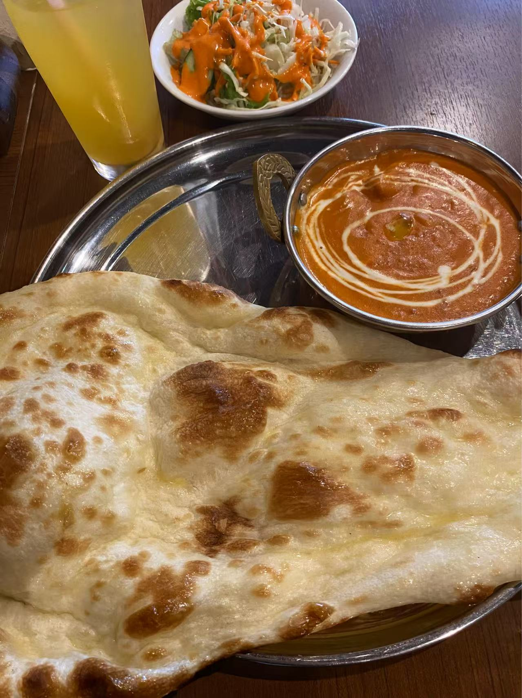

不知不觉距离关西游竟然已经过去了半年多了，我曾经很多次想鸽掉这篇游记🥹可是一些珍贵的记忆片段持续地在脑海中闪闪发光，让我没办法就这样遗弃。

我实在是拖延，但是又极有仪式感，终于开始动笔写这篇关西游记，一定是因为最近发生了什么值得纪念的事情......（btw本来想每个月都更新一篇博客内容，现在竟然拖延到三个月才能更新一篇🤯）

是的，我的三年多次签证下签啦！😼（去日本真的只有零次和无数次）

于是用这篇博客回忆短暂却浓墨重彩的关西游，以及要开始下次旅行的准备啦❤️‍🔥

## 大阪关西机场

湛蓝的天空，洁净的机场，令人安心的摆渡车司机，是我对日本的第一印象。

到了T1航站楼，先去机场便利店买了非常出名的牛奶布丁🍮再去Nodoka休息室淋浴洗去一身疲惫。休息室的工作人员态度非常温暖友好，下次我还来👻

## 超绝P人概念

一个人的旅行，我基本上没做什么规划，只是提前订好了机票和酒店。（因为家人聚会还改签了行程，再也不会了）

没有规划，就没有过高的期待，反而让我这几天的旅行自由而处处充满惊喜（和笑料）。

### 印度正宗日式咖喱

把行李放到酒店，有点想吃日式咖喱，google了最近的日式咖喱店，评分还不错，就出发去这家了。

我抬头确认招牌，没错。

推开门，和两个印度人面面相觑。

我打开谷歌地图界面跟他确认是这家店吗？着重强调日式咖喱。

印度小哥笑了，反问我有什么问题。

我很怂地说了没事，点了份车座子吃了，别说，还真挺好吃，日本的印度人做咖喱做得确实比尼日利亚的要干净好吃，确实配得上谷歌地图4点多的评分）

### 在宇治不吃抹茶吃鸭肉饭🍗

### 奈良小鹿扶老奶奶闯红灯🦌

### 不是我不想吃好饭

## 迷失在京都街头

## 最难忘的三十分钟